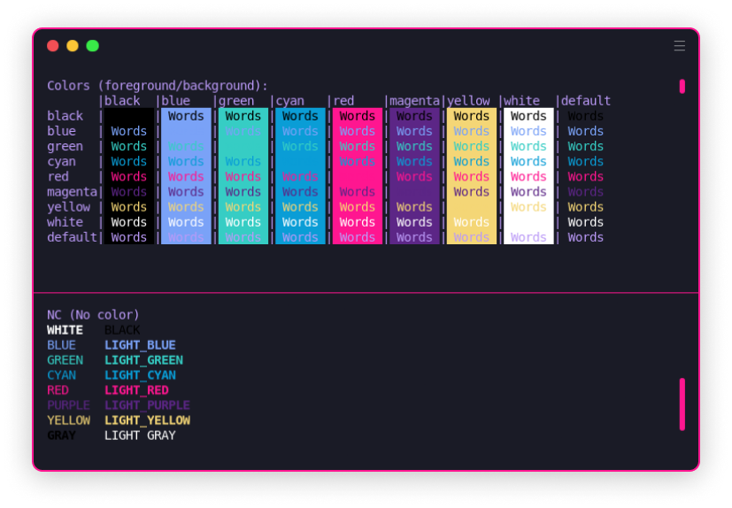

<h1 align="center">
HyperDowntown
</h1>

<h4 align="center">
🌆 Synthwave Hyper theme
</h4>


<div align="center">
  
</div> 


## Contents

- [Install](#install)
- [License](#license)

## Install

```js
// ~/.hyper.js
plugins: ["hyper-downtown"],
```

Get the theme on the official [Hyper Store](https://hyper.is/plugins/hyper-downtown).

### Hyper plugin manager

Firstly, ensure you have [Hyper](https://hyper.is) installed in your system. Once launched, type the following to get the theme.

```bash
$ npm install hyper-downtown
```

## Maintainer

- Thiago N. ([@thiagotnon](https://github.com/thiagotnon))

## License

[MIT](/license.md)